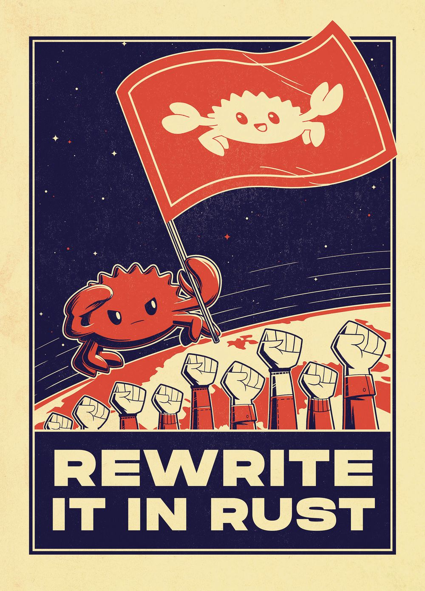

💾 A Man born in 1996

📅 Have been programming since 2018

🚀 Love creating safe fast programs using [Rust](https://www.rust-lang.org/)

🌐 Was previously a Web Developer

---

💬 SimpleX: [contact](https://simplex.chat/contact#/?v=2-5&smp=smp%3A%2F%2FSkIkI6EPd2D63F4xFKfHk7I1UGZVNn6k1QWZ5rcyr6w%3D%40smp9.simplex.im%2F2bCg0d1sZxMRBDXIuN4ZZaB2ayztf8oo%23%2F%3Fv%3D1-2%26dh%3DMCowBQYDK2VuAyEATsMb2h7MekFllorXceMQRSiOlAI8bozfncV0TTyxN0g%253D%26srv%3Djssqzccmrcws6bhmn77vgmhfjmhwlyr3u7puw4erkyoosywgl67slqqd.onion)

✉️ Mail: 7snuirzlb@mozmail.com

🔐 PGP:
<details><summary>Key</summary>
<p>

```
-----BEGIN PGP PUBLIC KEY BLOCK-----

mQINBGYYMa8BEADos2IDEmgE6nilOEqCVcBhM/U4Ra3CRwbM4OjaG/Dps0uLT6hQ
d9eD9su/yGp7gFaNOtuA/aPct7VxI5BYlNOpMWaG42un/TTdufWFG8vBuabrnQBn
jQ8RagOnQAVf8GLV68cDLGr8Q5BugQ9b3hY5jEXpVl7eaE5TaKPAOsvYhtCfEWnk
Wcasqx2I1p6g42KnD7RsZtgtT29DVr54zwT6kAucHpVfzo1II0T2X6pYQDsxNfCG
iLq7uAd+yKqCAYo9pnbrT9t5JG8/ebmBwnZh/qyeHyRXYF73OO2X935w7fiUrt4u
H9UbSB4GcmnJvnNJurmEy9DpXLs/yAdybC540MmDCwFAwykGyWgGxft3oMRQ7Mtx
FMVAHstnxo1PapgJAZhlT92EkcQxn5DS926VI9ZFxuk7sbdFqIP6lkPQCVByUOvE
N4Vbr1B+a/3/G5BKYaEFzmINSwt8r8cF0XQ45UCCYLcbD9Jnf++kM+o5+MRcuI+8
OS7UxKVNx+XCLPLsp3paJML6ztEMVeW6+MGXoCL4mj6XCoEsopelqeBh1qopONeg
RepuUsHA3owLfpS/5KHF5ptF+eymDlg4Yy9BK+Hxtq/6rlWnTHwvBRhMHPf5uf/G
PwYS35LMIVjw46qyZ4Hr78PvduHh0wY8wWBnNyUtDVXEcRE4uoJwRjXJIwARAQAB
tCtzYW5nLXNoZWx0b24oZ2l0aHViKTw3c251aXJ6bGJAbW96bWFpbC5jb20+iQJO
BBMBCAA4FiEE/AgB8Kjy8wGq0NY24kA+LoCt+FkFAmYYMa8CGy8FCwkIBwIGFQoJ
CAsCBBYCAwECHgECF4AACgkQ4kA+LoCt+FlGrRAAvjj/NfEvi/bFv8zWCAjMU5eX
mvGOidFshthHz4soZ99E5pXa82m9AzaH3GHkTCQ1zrLMHauemkDmJTf/u9Mtad5O
oq9nRfNui5Rke/jz9qDZjbOe8YbUhcQYKvPe5mUIgQYlq3xWRxPCvG/Q6S4LFWoJ
snWhrqaOMqCWn8LucT7mhXy+9+1KHBl5+I5hMsQFCpeufv7Wn2ZItvqeMMYbmefq
/Fi25ixreubrWycNxnufDEWvEP2RKlbTW61gq8hapYyJ8kKRMbxoyNn6dtRJp+Ul
JsXIZuzsV0+lOIE3FRxI8694O/ZFAuNeOu9jQbiOLpemkVjcmYJvo01akURoxGBu
jaC2hhWh7wWxVcUYHAsFU2Pq6RGiIBe/lYSqRqicDJQ6e7+XfkLvPsAb3JiPtZKN
7oY4l0QOFAgDZ0gbdUx2wtzTswBh54T25f1c+VjVZsgetTYhYVrEyCklp/4xyGz7
QTtZG/WUvxTgNh4EFnyKNp17qcVNXiC9BrgJTy9fbW+glgwkaOxxqHMme0XjwUW4
LSLK1HHq3IVpRI912PoX5Nqg5eWne5J+g8Enh1MG/1FCaXblnWm7U740xNGXAjR6
BtjC9o2DsDK+locJOFoGs7zKDczzsbbROQf+kleZAkbLhE62M2nZnyVRbb4uEL+V
gytCb9x7e2RKDd/+yL4=
=SzAl
-----END PGP PUBLIC KEY BLOCK-----
```

</p>
</details> 

---

⚔️ My Codewars account

<a href="https://www.codewars.com/users/UnlessEnduring/">
    
</a>

---

🛠️ Tools i currently use

   

⌛ Previous experience in

  
  


---

📚 Useful resources for learning Programming

[Learn C++](https://www.learncpp.com/)

[Learn Rust](https://www.rust-lang.org/learn)

[Rust Learning](https://github.com/ctjhoa/rust-learning)

---

<a href="http://www.wtfpl.net/">
    
</a>
<span>&nbsp;</span>
<a href="https://www.oshwa.org/">
    
</a>
<span>&nbsp;</span>
<a href="https://www.fsf.org/">
    
</a>
<span>&nbsp;</span>
<a href="http://www.wtfpl.net/">
    
</a>

---
